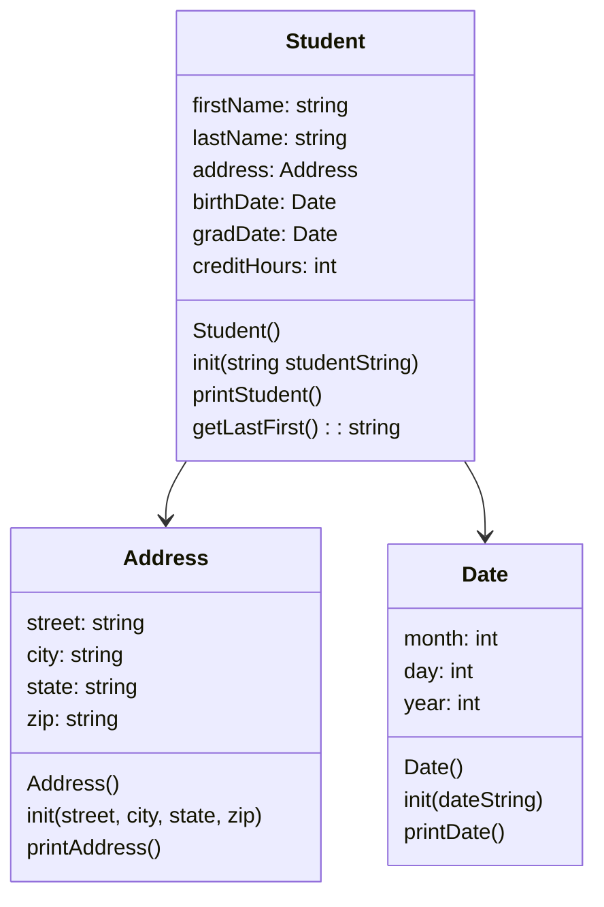

# cs121-project-7



## main.cpp algorithms

```
#include <iostream>
#include date header
#include student header
#include address header

int main() {
  print "Hello!" newline
  testAddress()
  testDate()
  testStudent()
  return 0
}

void testAddress() {
  create Address object a
  a.init(street, city, state, zip) //sets object variables to input strings
  a.printAddress()
  /* expected output example:
  1234 west boulevard
  Las Vegas NV, 75638 */
}

void testDate() {
  create Date object d
  d.init("mm/dd/yyyy") //set date from string
  d.printDate()
  /* expected output example:
  May 21, 2000 */
}

void testStudent() {
  string studentString = "first name, last name, street, city, state, zip, birth date, grad date, credit hours"
  create address to student object, then create student on heap
  student->init(studentString)
  student->printStudent()
  print newline
  print student->getLastFirst()
  delete student from heap
}
```

## Address class

```
Address() {
  // sets street, city, state, and zip variables to placeholder values
}

void init(street, city, state, zip) {
  // sets street, city, state, and zip variables to input strings
}

void printAddress() {
  print street + newline
  print city state, zip + newline
}
```

## Date class

```
Date() {
  //set month, day, and year to placeholder values
}

void init(dateString) {
  create stringstream converter
  create placeholder string variables for month, day, and year

  converter.str(dateString)
  getline(from converter, send to sMonth, end at "/")
  getline(from converter, send to sDay, end at "/")
  getline(from converter, send to sYear)

  converter.clear()
  converter.str("")

  input sMonth, sDay, and sYear into converter separated by spaces
  output from converter to month, day, and year as ints
}

void printDate() {
  create array[size 13] containing each month as a string (index 0 is blank "")
  print: array[month] day, year
}
```

## Student class

```
Student() {
    set firstName, lastName, and creditHours to default values
}

void init(studentString) {
    create stringstream converter
    create temp strings:
        street
        city
        state
        zip
        sBirth
        sGrad
        sCredits
    
    set converter to studentString
    getline from converter, set to each var and temp var, split by ','

    //initialize address, birth date, and graduation date
    address.init(street, city, state, zip)
    birthDate.init(sBirth)
    gradDate.init(sGrad)

    clear converter
    input from sCredits to converter
    output int from converter to creditHours
}

void printStudent() {
    print: firstName + " " + lastName
    address.printAddress
    print: "DOB: " then birthDate.printDate()
    print: "Grad: " then gradDate.printDate()
    print: "Credits: " + creditHours
}

string getLastFirst() {
    create lastFirst string containing:
    "____________________________________\n \n"
    lastName + ", " + firstName
    return lastFirst
}
```
